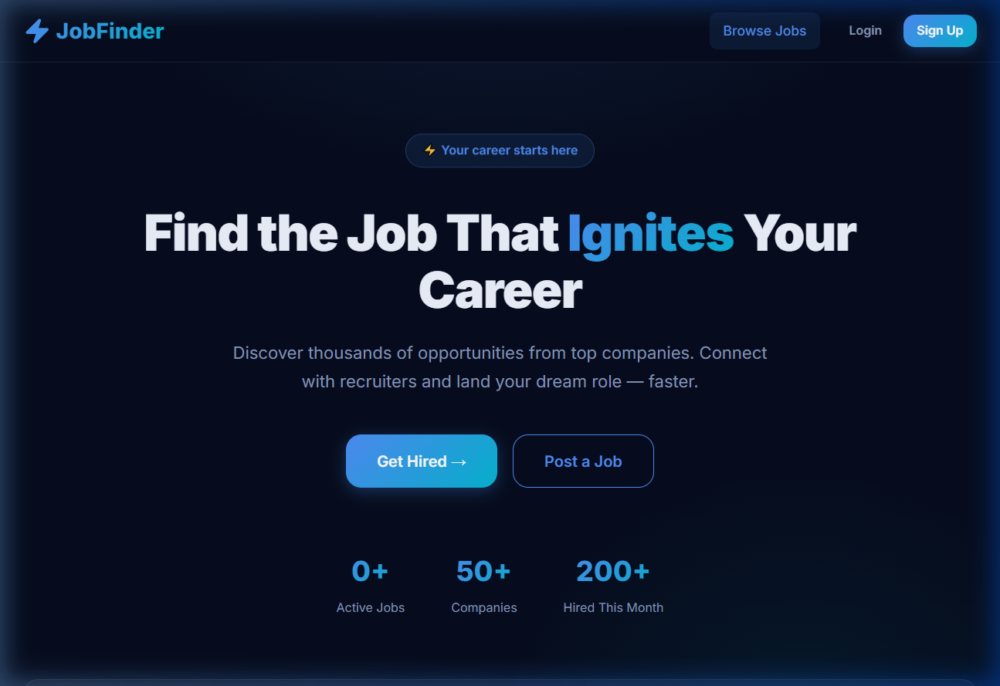
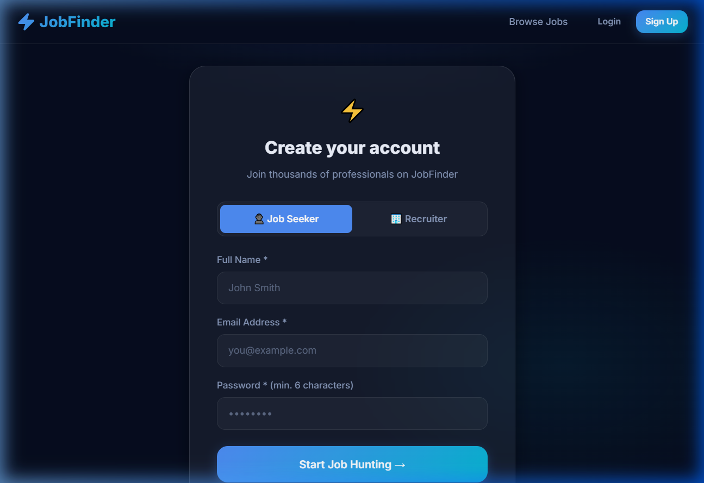
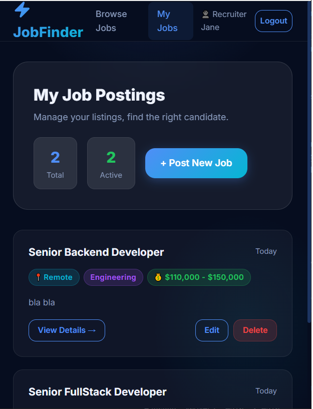
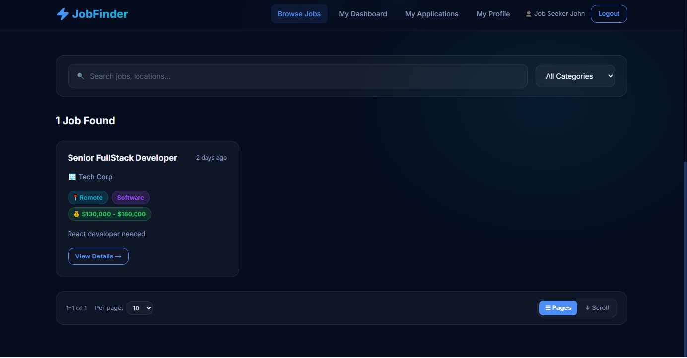
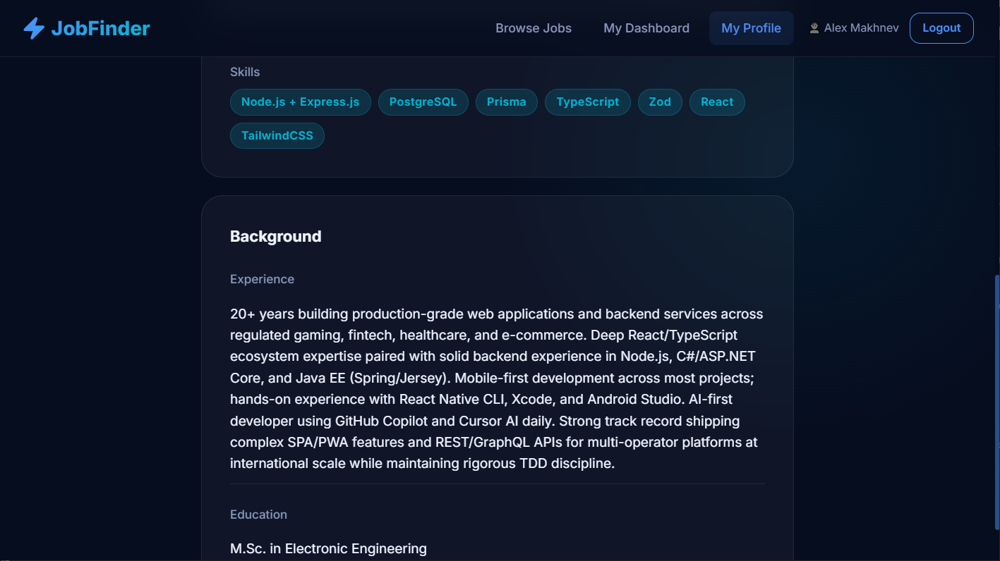
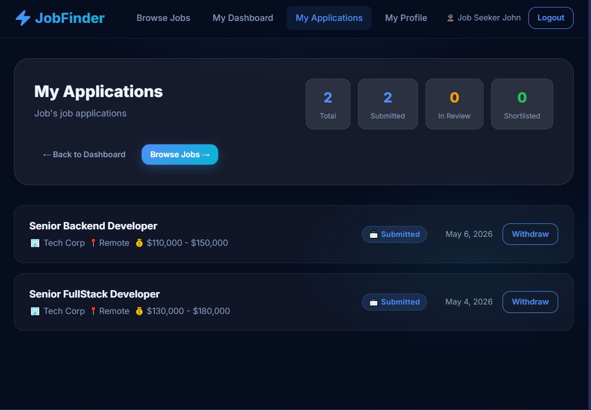

# ⚡ Job Finder — Frontend

A React 19 + TypeScript single-page application for the Job Finder platform. Features role-based dashboards for Job Seekers and Recruiters, JWT cookie auth, server-side paginated job search, profile management, and an **async job application workflow** backed by a Redis/Bull message queue — all wrapped in a premium dark-mode UI.

---

## 📸 Screenshots

### Landing Page


### Login Page


### Signup Page (tab-based role selector)


### Job List (after login as Admin)


### Job List (after login as Recruiter)


### Job List (after login as JobSeeker)


### Recruiter Profile


### Job Seeker Profile


### Job Seeker Profile (continued)


### Job Seeker — My Applications


---

## 🛠 Tech Stack

| Technology | Version | Purpose |
|------------|---------|---------|
| React | 19 | UI library |
| TypeScript | ~5.8 | Type safety |
| Vite | 7+ | Dev server & bundler |
| TailwindCSS | v4 | Utility CSS (via `@tailwindcss/vite`) |
| react-router-dom | v7 | Client-side routing + URL state |
| axios | ^1.16 | HTTP client with request/response interceptors |

---

## 🏗 Project Structure

```
src/
├── api/
│   ├── axiosClient.ts        # Base axios instance + auth interceptors
│   ├── auth.api.ts           # signup, login, logout, getMe
│   ├── jobs.api.ts           # searchJobs (paginated), getAllJobs, getJobById, CRUD
│   ├── profile.api.ts        # get/update recruiter & job-seeker profiles
│   ├── applications.api.ts   # applyToJob (enqueue), getMyApplications, withdrawApplication
│   └── queue.api.ts          # getQueueJobStatus, pollUntilDone helper
├── context/
│   └── AuthContext.tsx       # User state, token lifecycle, hasRole()
├── hooks/
│   ├── usePaginatedJobs.ts   # Debounce, pagination, infinite-scroll, URL sync
│   └── useJobSearch.ts       # Server-side search wrapper (debounced)
├── types/
│   └── index.ts              # TypeScript interfaces (User, Job, Application, profiles…)
├── components/
│   ├── ui/                   # Button, Input, Card, Badge, Modal, Pagination
│   ├── layout/               # Navbar, ProtectedRoute
│   └── jobs/                 # JobCard, JobList, JobForm, JobFilterBar,
│                             # ApplyModal, ApplicationsList
└── pages/
    ├── LandingPage.tsx               # Public — browse & filter jobs (paginated)
    ├── LoginPage.tsx                 # Public — sign in
    ├── SignupPage.tsx                # Public — register (seeker or recruiter tabs)
    ├── JobDetailPage.tsx             # Public — full job detail + Apply CTA
    ├── jobseeker/
    │   ├── DashboardPage.tsx         # Protected (JOB_SEEKER) — browse jobs
    │   ├── ProfilePage.tsx           # Protected (JOB_SEEKER) — view/edit profile
    │   └── ApplicationsPage.tsx      # Protected (JOB_SEEKER) — my applications
    └── recruiter/
        ├── DashboardPage.tsx         # Protected (RECRUITER) — CRUD job postings
        └── ProfilePage.tsx           # Protected (RECRUITER) — view/edit profile
```

---

## 🔐 Auth Flow

1. **Signup / Login** → backend returns `{ accessToken }` and sets a `refreshToken` HTTP-only cookie.
2. `accessToken` is stored in `localStorage` and attached to every request via an axios request interceptor (`Authorization: Bearer <token>`).
3. On page reload, the stored token is restored and `GET /api/auth/me` is called to rehydrate the user session.
4. On any `401` response, the axios response interceptor fires an `auth:unauthorized` custom event; `AuthContext` listens and clears local state.
5. After a successful login, users are redirected to their role-specific dashboard:
   - `RECRUITER` → `/dashboard/recruiter`
   - `JOB_SEEKER` → `/dashboard/seeker`

---

## 🌐 API Integration

All calls go through `axiosClient` with `baseURL: '/api'` (Vite proxies `/api` → `http://localhost:5002`).

### Auth

| Method | Endpoint | Auth | Usage |
|--------|----------|------|-------|
| `POST` | `/auth/signup/jobseeker` | — | Job Seeker registration |
| `POST` | `/auth/signup/recruiter` | — | Recruiter registration |
| `POST` | `/auth/login` | — | Login |
| `POST` | `/auth/logout` | — | Logout |
| `GET`  | `/auth/me` | Bearer | Restore session |

### Jobs

| Method | Endpoint | Auth | Usage |
|--------|----------|------|-------|
| `GET`  | `/jobs/all` | — | Paginated + filtered job listing |
| `GET`  | `/jobs/:id` | — | Job detail page |
| `GET`  | `/jobs/recruiter` | `RECRUITER` | Recruiter's own job listings |
| `POST` | `/jobs` | `RECRUITER` | Create job |
| `PUT`  | `/jobs/:id` | `RECRUITER` | Update job |
| `DELETE` | `/jobs/:id` | `RECRUITER` | Delete job |

### Profiles

| Method | Endpoint | Auth | Usage |
|--------|----------|------|-------|
| `GET`  | `/recruiter/profile` | `RECRUITER` | Get recruiter profile |
| `PATCH` | `/recruiter/profile` | `RECRUITER` | Update recruiter profile |
| `GET`  | `/jobseeker/profile` | `JOB_SEEKER` | Get job seeker profile |
| `PATCH` | `/jobseeker/profile` | `JOB_SEEKER` | Update job seeker profile |

### Applications

| Method | Endpoint | Auth | Usage |
|--------|----------|------|-------|
| `POST` | `/jobseeker/apply/:jobId` | `JOB_SEEKER` | Enqueue application — returns `202` + `{ jobId }` |
| `GET`  | `/jobseeker/applications` | `JOB_SEEKER` | List my applications |
| `DELETE` | `/jobseeker/applications/:id` | `JOB_SEEKER` | Withdraw application |

### Queue

| Method | Endpoint | Auth | Usage |
|--------|----------|------|-------|
| `GET` | `/queue/job/:jobId` | — | Poll status of a queued write (apply / save-job) |

---

## 🔑 Role-Based Routing

| Path | Component | Guard |
|------|-----------|-------|
| `/` | `LandingPage` | Public |
| `/login` | `LoginPage` | Public |
| `/signup` | `SignupPage` | Public |
| `/jobs/:id` | `JobDetailPage` | Public |
| `/dashboard/seeker` | `JobSeekerDashboard` | `JOB_SEEKER` required |
| `/dashboard/seeker/applications` | `ApplicationsPage` | `JOB_SEEKER` required |
| `/profile/seeker` | `JobSeekerProfilePage` | `JOB_SEEKER` required |
| `/dashboard/recruiter` | `RecruiterDashboard` | `RECRUITER` required |
| `/profile/recruiter` | `RecruiterProfilePage` | `RECRUITER` required |

`ProtectedRoute` redirects unauthenticated users to `/login` and users without the required role to `/`.

---

## 📬 Async Apply Flow

Applying to a job is now fully asynchronous to keep the UI responsive under high load:

1. **`ApplyModal` submits** → `POST /api/jobseeker/apply/:jobId` — backend responds `202 Accepted` with a Bull `jobId`.
2. **Modal polls** → `GET /api/queue/job/:jobId` every 600 ms (via `pollUntilDone` in `queue.api.ts`) until the status is `completed` or `failed`, or 30 s elapses.
3. **On `completed`** — the `result` field contains the created `Application` object; the modal surfaces a success message and calls `onSuccess(application.id)`.
4. **On `failed`** — the `failedReason` is shown to the user as an error.
5. **AbortController** is used to cancel in-flight polling when the modal closes or the component unmounts.

```
apply click → POST /apply/:jobId → 202 { jobId }
  └─ poll GET /queue/job/:jobId (600 ms interval, 30 s max)
        ├─ status: waiting/active → keep polling
        ├─ status: completed → show success, call onSuccess()
        └─ status: failed → show error, re-enable form
```

---

## 🔍 Search, Pagination & Infinite Scroll

The `usePaginatedJobs` hook (used on LandingPage and Seeker Dashboard) provides:

- **Debounced search** (300 ms) — filters by title, location, and description.
- **Configurable page sizes** — `10 / 25 / 50` items per page, selectable via the UI.
- **Infinite-scroll mode** — toggle to replace classic pagination with "Load More".
- **URL state persistence** — `search`, `category`, `page`, and `pageSize` are synced to query params so filters survive navigation and sharing.

For the Landing Page, `searchJobs()` additionally passes params server-side to `GET /jobs/all`, enabling server-driven pagination and reducing client-side data transfer.

---

## ⚙️ Development

### Prerequisites
- Node.js 18+
- The backend must be running on port 5002 (see [`../job-finder-backend-customized`](../job-finder-backend-customized))

### Install & run

```bash
cd job-finder-react-customized
npm install
npm run dev
# Dev server: http://localhost:3000
# /api requests proxied → http://localhost:5002
```

### Lint

```bash
npm run lint
```

### Build for production

```bash
npm run build   # TypeScript check + Vite bundle → dist/
npm run preview # Preview the production build locally
```

---

## 🧩 Key Types (`src/types/index.ts`)

```ts
type Role = 'JOB_SEEKER' | 'RECRUITER' | 'ADMIN';
type ApplicationStatus = 'submitted' | 'shortlisted' | 'under_review' | 'rejected';

interface User {
  id: string; name: string; email: string;
  roles: Role[]; isActive: boolean;
  createdAt: string; updatedAt: string;
}

interface JobSeekerProfile {
  id: string; userId: string;
  bio?: string; location?: string; skills: string[];
  education?: string; experience?: string; resumeUrl?: string;
  user?: Pick<User, 'id' | 'name' | 'email'>;
}

interface RecruiterProfile {
  id: string; userId: string;
  companyName: string; companyWebsite?: string;
  description?: string; industry?: string;
  user?: Pick<User, 'id' | 'name' | 'email'>;
}

interface Job {
  id: string; recruiterId: string; title: string;
  description: string; requirements: string; location: string;
  salaryRange?: string; category?: string; isActive: boolean;
  createdAt: string; updatedAt: string;
  recruiter?: { companyName: string; industry?: string; companyWebsite?: string };
}

interface Application {
  id: string; jobId: string; jobSeekerId: string;
  coverLetter?: string; status: ApplicationStatus;
  createdAt: string; updatedAt: string;
  job?: { id: string; title: string; location: string;
          salaryRange?: string; category?: string;
          recruiter?: { companyName: string } };
}
```

---

## 🔗 Backend

API source: [`../job-finder-backend-customized`](../job-finder-backend-customized) — Express / Prisma / PostgreSQL running on **port 5002**.
